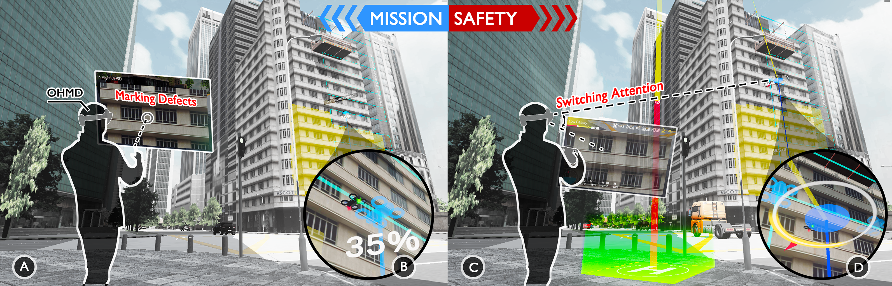

# SafeSpect: Safety-First Augmented Reality Heads-up Display for Drone Inspections

A mixed-reality drone inspection simulator for studying how information visualization strategies affect operator performance and safety awareness during drone inspection tasks.



**Paper:** [SafeSpect: Safety-First Augmented Reality Heads-up Display for Drone Inspections](https://arxiv.org/abs/2504.16533)

> **Developed by [Pepper Xu](https://pepperxu.github.io)** — visit for more projects and research.

---

## Overview

This simulator runs on Meta Quest 3 and presents operators with a realistic urban building inspection scenario. Operators pilot a simulated drone (manually or via autopilot) while the system logs flight behavior, defect detection performance, and safety metrics. Three visualization modes—**Mission Only**, **Safety Only**, and **Adaptive**—can be switched by an experimenter at runtime to study how visualization design affects dual-task performance.

Forked from [UAVs-at-Berkeley/UnityDroneSim](https://github.com/UAVs-at-Berkeley/UnityDroneSim).

---

## Installation

### Option A: Install from Release (Recommended)

A pre-built APK for Meta Quest 3 is available in the [`Release/`](Release/) folder.

1. Enable **Developer Mode** on your Meta Quest 3 (via the Meta smartphone app).
2. Connect the headset to your PC via USB.
3. Install the APK using ADB:
   ```bash
   adb install safespect.apk
   ```
   Or use [Meta Quest Developer Hub](https://developer.oculus.com/meta-quest-developer-hub/) to sideload the APK.
4. Launch the app from the **Unknown Sources** section in your Quest library.

### Option B: Build from Source

**Requirements:**
- [Unity Hub](https://unity.com/download)
- Unity **6.4 (6000.4.0f1)** — install via Unity Hub with the **Android Build Support** module (including Android SDK & NDK Tools and OpenJDK). Exact editor version: `6000.4.0f1`
- Meta Quest 3 with Developer Mode enabled

**Steps:**

1. Clone this repository:
   ```bash
   git clone https://github.com/your-org/drone-safety-sim.git
   ```
2. Open the project in Unity Hub using Unity **6000.4.0f1**.
3. Open the main scene: `Assets/Scenes/DroneSim.unity`
4. Go to **File → Build Settings**, select **Android**, and click **Switch Platform**.
5. Under **Player Settings → XR Plug-in Management → Android**, ensure **OpenXR** is enabled and **Meta Quest feature set** is selected.
6. Connect your Quest 3 via USB, enable USB debugging in Developer Mode, then click **Build and Run**.

---

## Scenes

| Scene | Description |
|-------|-------------|
| `Assets/Scenes/DroneSim.unity` | Main simulation — participant's VR view |
| `Assets/Scenes/DataProcessing.unity` | Post-flight data analysis and visualization |

---

## Using the Simulation

### Drone Controls (Quest 3 Controllers)

The simulator uses a standard RC-style two-stick layout via the Quest 3 touch controllers.

| Action | Input |
|--------|-------|
| **Translate** (forward / back / left / right) | Left thumbstick |
| **Altitude** (up / down) | Right thumbstick vertical |
| **Yaw** (rotate left / right) | Right thumbstick horizontal |
| **Take Off** | In-headset UI button or mapped button |
| **Return to Home (RTH)** | In-headset UI button |
| **Engage Autopilot** | In-headset UI button (must be in flight zone) |
| **Mark Defect** | Click on camera view while in flight |
| **Switch Visualization** (Adaptive mode only) | Hold **Y button** (right controller) |
| **Reset Experiment** | Hold **B button** (left controller) for 1.5 s |

> **Note:** Manual stick input while autopilot is engaged will automatically disengage autopilot and return to manual control.

### Mission Flow

```
Planning → Fly to Flight Zone → (Optional) Engage Autopilot → Inspect Building → RTH / Done
```

1. **Planning** — Review the building and flight plan shown on the HUD.
2. **Moving to Flight Zone** — Take off and fly toward the building inspection zone. The mission state updates automatically when the drone enters the designated buffer zone.
3. **In Flight Zone** — Manual piloting or autopilot can be engaged here. Mark defects with the dedicated button.
4. **Autopilot / Inspecting** — The drone follows the pre-planned 4×12 inspection grid waypoint path automatically. Move the sticks to take back manual control at any time.
5. **Returning** — Trigger RTH manually or let the battery threshold trigger an automatic return. The drone navigates back to the home position and lands.

### Visualization Modes

Three interface conditions are available:

| Mode | Description |
|------|-------------|
| **2D Only** | Traditional 2D HUD overlay only — no world-anchored 3D elements |
| **All (Mission + Safety)** | Both mission waypoints and all safety indicators shown simultaneously in 3D |
| **Adaptive** | Context-aware: shows **Mission** overlays during autopilot, **Safety** overlays during manual flight. Operator can momentarily reveal the alternate view by holding the **Y button**. |

### Sensor Simulation

The simulation models realistic drone sensor degradation:

- **GPS**: Signal strength 0–3; signal loss causes positional drift. GPS weak zones are placed in the scene.
- **Collision Sensing**: 16-ray circular sensor pattern; **Caution** alert < 6 m, **Warning** < 3 m. Autopilot disengages automatically on Warning.
- **Battery**: Discharges over flight time; auto-RTH triggers when remaining charge falls below the threshold needed to return home.
- **Wind**: Random pulse noise and wind zone volumes apply forces to the drone Rigidbody.
- **FPV Camera**: Configurable 0–16 frame latency on the first-person camera feed.

### Data Logging

When a session is recording, two CSV files are written to the Quest's persistent data path:

| File | Contents |
|------|----------|
| `log_event.csv` | Timestamped event log (state changes, defect marks, condition switches) |
| `log_full.csv` | Per-physics-frame log of drone pose, waypoint index, control mode, flight state, battery, GPS, and collision status |

Files are saved under `<persistentDataPath>/<participant_id>/log_<config>_<condition>_<timestamp>/`.

---

## Project Structure

```
Assets/Scripts/
├── Core/           # DroneManager (state machine), Communication (data bus), StateFinder
├── Controller/     # VelocityControl (PID), AutopilotManager, ExperimentServer (TCP)
├── SystemModules/  # Battery, CollisionSensing, GPS, FlightPlanning, Wind
├── InputModule/    # XR controller input, ray interaction
├── Visualization/  # HUD, world-space overlays, adaptive vis switching (VisType)
└── Utilities/      # Billboard, auto-decay, text binding helpers
```

---

## Citation

If you use this simulator in your research, please cite:

```bibtex
@inproceedings{xu2025safespect,
  title={SafeSpect: Safety-first augmented reality heads-up display for drone inspections},
  author={Xu, Peisen and Garcia, J{\'e}r{\'e}mie and Ooi, Wei Tsang and Jouffrais, Christophe},
  booktitle={Proceedings of the 2025 CHI Conference on Human Factors in Computing Systems},
  pages={1--17},
  year={2025}
}
```

---

## License

This project is a fork of [UAVs-at-Berkeley/UnityDroneSim](https://github.com/UAVs-at-Berkeley/UnityDroneSim). Please refer to the original repository for license terms.
